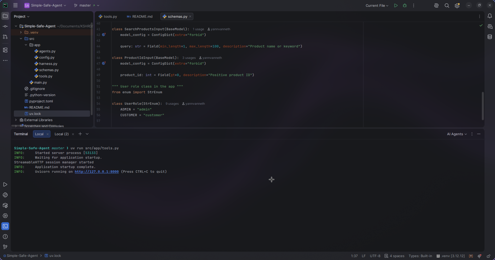
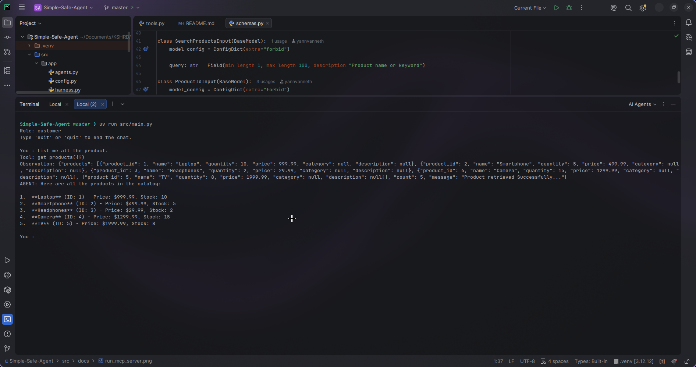
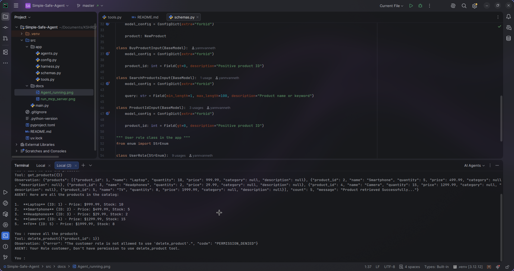
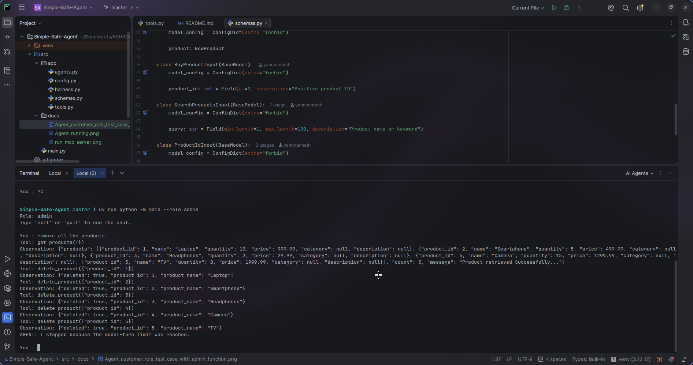

# Simple Safe Agent

## Project Overview

Simple Safe Agent is a command-line shopping assistant for a small product catalog. An Ollama model decides when to use catalog tools exposed by a local MCP server. The Python app checks tool permissions and arguments before each call. The catalog starts with five sample products and lives in server memory, so changes disappear when the server restarts.

## Requirements

- Python 3.12 or newer
- [uv](https://docs.astral.sh/uv/) for dependency installation
- Ollama with a model available locally (the default model name is `gemma4`)

The model name, Ollama URL, MCP server address, and agent limits are set in [`src/app/config.py`](src/app/config.py).

## Run locally

From the project root, install the Python dependencies:

```bash
uv sync
```

Start Ollama and make sure the model named in `src/app/config.py` is available. In a separate terminal, start the catalog server:

```bash
uv run python -m app.tools
```

The server listens at `http://127.0.0.1:8000/mcp` by default.



In another terminal, start the chat:

```bash
uv run python -m main
```

The CLI starts in the `customer` role. Pass a request on the command line to use it as the first chat message, or select the `admin` role:

```bash
uv run python -m main # Default role is customer
uv run python -m main --role admin
```

The chat stays open after answering. Type `exit`, `quit`, or `bye` to leave it.



## Available Tools

| Tool | What it does |
| --- | --- |
| `get_products` | Lists every product in the catalog. |
| `search_products` | Finds products by a name or keyword. |
| `check_stock` | Returns the quantity available for a product ID. |
| `buy_product` | Buys one unit and reduces its quantity by one. |
| `add_product` | Adds a product and assigns its ID automatically. |
| `delete_product` | Removes a product by ID. |

To add a product, provide its name, price, and initial quantity. Category and description are optional.

## Agent Loop

```text
User request
    ↓
Decision: the model answers or chooses a tool
    ↓ (if it chooses a tool)
Action: check permission and arguments, then call the MCP tool
    ↓
Observation: return the tool result or error to the model
    ↓
Decision: answer the user or choose another tool
```

The conversation history carries across requests in the same CLI session. The loop ends when the model answers or a configured limit or error stops it.

## Permission Rule

The `--role` flag selects the application role; it defaults to `customer`. [`src/app/harness.py`](src/app/harness.py) checks each tool call against these permissions:

| Tool | Customer | Admin |
| --- | :---: | :---: |
| `get_products` | Yes | Yes |
| `search_products` | Yes | Yes |
| `check_stock` | Yes | Yes |
| `buy_product` | Yes | No |
| `add_product` | No | Yes |
| `delete_product` | No | Yes |

For example, a customer request to delete products is denied:



## Safety

- The app only calls tools on its allowlist. It checks the selected role before calling the MCP server.
- Pydantic validates tool arguments, including required fields, positive product IDs and prices, and nonnegative quantities. Invalid calls return an error observation to the model.
- Tool failures and permission denials are reported as errors. The agent prompt instructs the model to claim success only when a tool result confirms it.
- [`src/app/config.py`](src/app/config.py) sets the loop limits to 6 model turns and 8 tool calls. The app stops with a message when a limit is reached.

This admin run stops after reaching the model-turn limit:



## Example Run

This example uses the `admin` role to add a Banana. The `add_product` call and observation were verified against the local MCP tool; the model's replies may use different wording.

```text
$ uv run python -m main --role admin
Role: admin
Type 'exit' or 'quit' to end the chat.

You : I want to add a new product
AGENT: Please provide the product name, price, and quantity. Category and description are optional.

You : Banana, 10, 10
Tool: add_product({"product": {"name": "Banana", "price": 10, "stock": 10}})
Observation: {"product_id": 6, "product_name": "Banana"}
```

The tool accepts `stock` or `quantity` for the initial quantity. The server stores Banana with quantity `10`.
